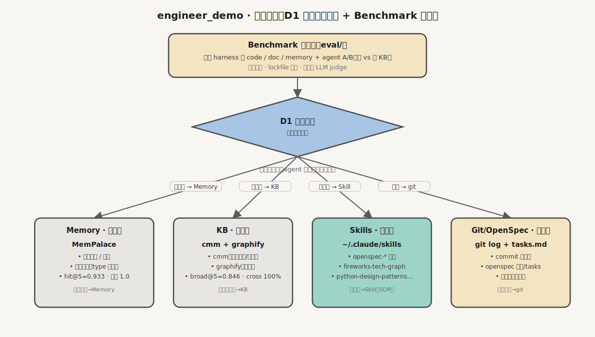
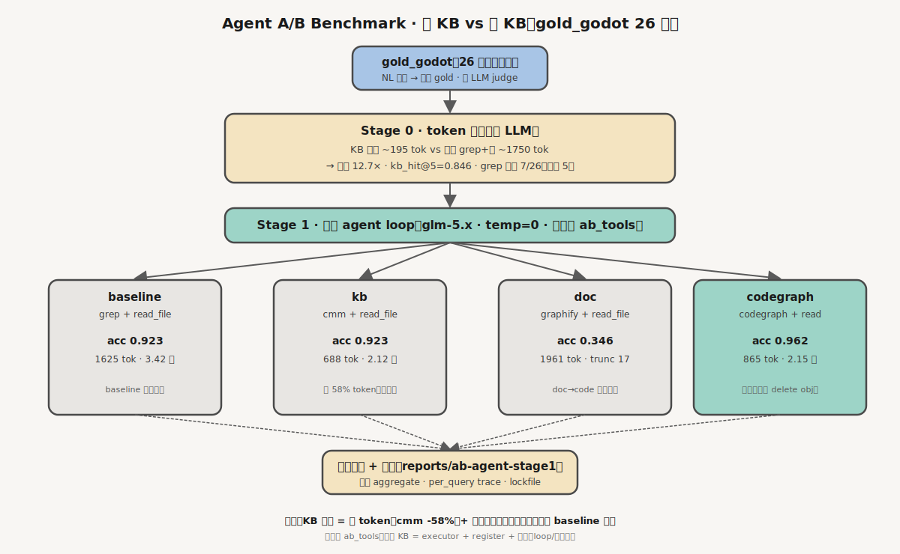
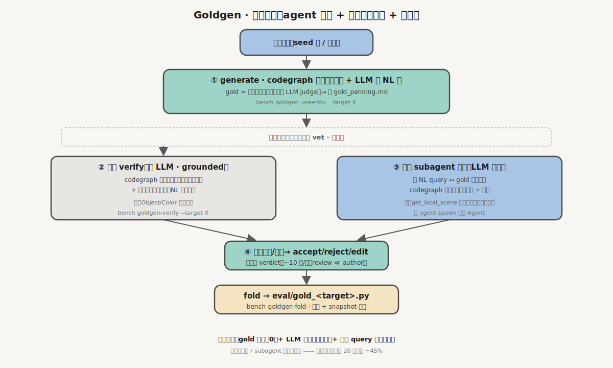
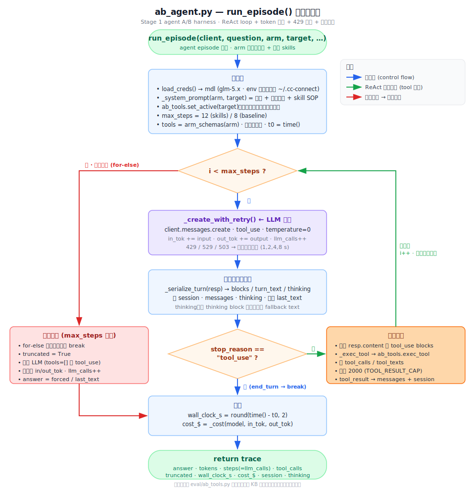

# 流程图索引（fireworks-tech-graph 生成）

> 用 [fireworks-tech-graph](https://github.com/yizhiyanhua-ai/fireworks-tech-graph) skill（style 6 Claude 官方风）从工程实际产出绘制。
> SVG 为源（GitHub README 原生渲染）；PNG 由 cairosvg/rsvg-convert 导出（1920px）。

## 1. 系统架构（D1 记忆四层归属 + Benchmark 评测）



四层归属纪律（D1 判定金句）+ 顶部 Benchmark 评测层。候选事实经「忘了这条 agent 会不会被纠正？」路由到：
- **会纠正 → Memory**（MemPalace，主观层）
- **被问起 → KB**（cmm + graphify，客观层）
- **怎么做 → Skills**（~/.claude/skills，程序层）
- **何时发生 → Git/OpenSpec**（情景层）

## 2. Agent A/B Benchmark 流程（有 KB vs 无 KB）



同一批 gold_godot 26 题，两 stage：
- **Stage 0**（零 LLM token 代理）：KB 注入 vs 朴素 grep+读 → 压缩 12.7× / kb_hit@5=0.846
- **Stage 1**（真跑 agent loop）：四臂 baseline/kb/doc/codegraph 对照 → 准确度 + token + 步数

注册表 `ab_tools.py`：接新 KB = executor + register + 挂臂，loop/判分零改。

## 3. Goldgen 扩题流程（agent 挖题 + 两层验收 + 人审）



低成本扩 gold 集，**人审前过两层自动 vet**：
- ① generate：codegraph 枚举真实符号 + LLM 拟题（gold 构造即正确，零 judge）
- ② 实证 verify（零 LLM）：抓同名歧义
- ③ 独立 subagent 验收：抓 NL query↔gold 语义错配（实证漏的）
- ④ 人审 → fold 进 gold

成本分离：gold 自证（0）+ LLM 拟措辞（便宜）+ 人审 query（轻）。

## 4. ab_agent.py — run_episode() 执行流程



Stage 1 agent loop 控制流（ReAct + token 累计 + 429 退避 + 收敛纪律）：初始化 → 迭代守卫 `i < max_steps` → `_create_with_retry()` LLM 调用 → 序列化本轮响应/累计 token → 判定 `stop_reason`：
- **tool_use**（循环回边）：遍历 tool_use blocks → `_exec_tool` / `ab_tools.exec_tool` → 截断 2000 写回 messages → 下一轮 `i++`
- **end_turn**：`break` 直接收尾
- **max_steps 耗尽**（for-else）：`truncated=True` + 强制作答（再调 LLM，`tools=[]` 禁 tool_use）→ 收尾

---

## 重新生成

```bash
# 装渲染器（任一）：brew install librsvg ｜ pip install cairosvg（需 libcairo）
# SVG 源在 docs/diagrams/*.svg，可直接编辑后重导 PNG：
rsvg-convert -w 1920 architecture.svg -o architecture.png
```
